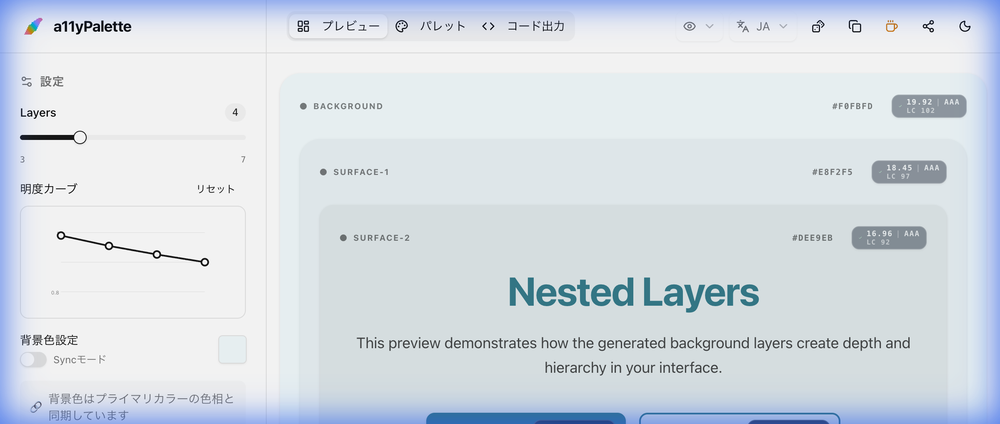

# OKLCH Theme Generator



[](https://a11ypalette.gigaptera.com)
[](https://nextjs.org/)
[](https://www.typescriptlang.org/)
[](LICENSE)

[English](#english) | [日本語](#japanese)

> [!TIP]
> **Try the Demo:** [https://a11ypalette.gigaptera.com](https://a11ypalette.gigaptera.com)

---

<a name="english"></a>

## English

### Overview

OKLCH Theme Generator is a professional color theme generation tool built with the OKLCH color space. It enables designers and developers to create consistent, accessible color systems that work seamlessly across both light and dark modes.

**Key Features:**

- 🎨 **OKLCH-based color generation** - Perceptually uniform color space for predictable results
- 🌓 **Automatic light/dark mode adaptation** - Single color input generates both themes
- 📊 **Visual lightness curve editor** - Fine-tune background layer progression
- ⚡ **Real-time preview** - See changes instantly in a nested layer preview
- 📋 **Export to CSS/Tailwind** - Copy-ready code for your projects
- 🎯 **Lightness validation** - Ensures optimal visibility in both themes (0.4-0.7 range)
- ♿ **Accessibility Safety** - Color blindness simulation & contrast checks

### Theme Generation Logic

#### 1. Color Space: OKLCH

This tool uses the **OKLCH color space** (Oklab in cylindrical coordinates), which offers:

- **Perceptual uniformity**: Equal numerical changes result in equal perceived color differences
- **Predictable lightness control**: L (Lightness) directly maps to perceived brightness
- **Intuitive hue rotation**: H (Hue) follows the color wheel naturally
- **Saturation control**: C (Chroma) provides consistent saturation adjustments

#### 2. Brand Colors

Generate three brand color variants (Primary, Secondary, Tertiary):

**Input Parameters:**

- Base color (HEX format)
- Automatically converted to OKLCH

**Generation Process:**

```
For each brand color:
  - Light variant: L + 0.1 (brighter)
  - Default variant: Original L
  - Dark variant: L - 0.1 (darker)

Each variant generates an "on-color" (text color) with optimal contrast
```

**Recommended Lightness Range:**

- **0.4 - 0.7** for brand colors
- Ensures visibility in both light and dark themes
- Out-of-range colors trigger a warning

**Theme Consistency:**

- Brand colors remain **consistent** across light/dark themes
- Maintains brand identity regardless of theme mode

#### 3. Layer Scale (Background Colors)

Generates a progression of background layers for depth and hierarchy:

**Input Parameters:**

- **Hue**: 0-360° (color wheel position)
- **Chroma**: 0-0.4 (saturation level)
- **Layer Count**: 1-20 layers
- **Mode**: Light or Dark
- **Direction**: Normal (light→dark) or Inverted (dark→light)
- **Custom Lightness** (optional): Manual curve adjustment

**Default Lightness Curves:**

_Light Mode (Normal):_

```
Generates values from 1.0 (white) to 0.8 (light gray)
Evenly distributed across layer count
```

_Dark Mode (Normal):_

```
Generates values from 0.0 (black) to 0.6 (mid gray)
Evenly distributed across layer count
```

_Inverted Direction:_
Reverses the lightness progression

**Custom Lightness Curve:**

- Interactive chart allows manual adjustment of each layer
- Drag control points to create custom progressions
- Per-layer precision for exact design requirements

**Opposite Theme Generation:**

```
For each layer:
  Opposite.L = 1.0 - Original.L
  Maintains same Hue and Chroma

Result: Inverted lightness for automatic dark mode
```

#### 4. Chroma Groups

Create additional color groups with specific chroma values:

**Use Cases:**

- Tag colors
- Category indicators
- Accent colors
- Status indicators

**Parameters:**

- Group name
- Chroma value (0-0.3)
- Base lightness
- Color count (hue distribution around color wheel)

#### 5. On-Colors (Text Colors)

For every generated color, an optimal text color is calculated:

**Algorithm:**

```
1. Calculate WCAG contrast ratio between color and white
2. If ratio ≥ 4.5: use white (#FFFFFF)
3. If ratio < 4.5: use black (#000000)
4. Ensures WCAG AA compliance for normal text
```

### Export Formats

#### CSS Variables

```css
:root {
  --color-primary-default: #3b82f6;
  --color-on-primary-default: #ffffff;
  --color-background: #ffffff;
  --color-surface-1: #f9fafb;
  /* ... */
}
```

#### Tailwind CSS

```javascript
module.exports = {
  theme: {
    extend: {
      colors: {
        primary: {
          light: "#60a5fa",
          DEFAULT: "#3b82f6",
          dark: "#2563eb",
        },
        // ...
      },
    },
  },
};
```

### Installation & Usage

```bash
# Install dependencies
npm install

# Run development server
npm run dev

# Build for production
npm run build

# Start production server
npm start
```

Open [http://localhost:3000](http://localhost:3000) to use the tool.

### Tech Stack

- **Framework**: Next.js 15 (React 19)
- **Styling**: Tailwind CSS
- **UI Components**: shadcn/ui
- **Color Library**: culori
- **Language**: TypeScript

---

<a name="japanese"></a>

## 日本語

### 概要

OKLCH Theme Generator は、OKLCH カラースペースを使用したプロフェッショナルなカラーテーマ生成ツールです。デザイナーと開発者が、ライトモードとダークモードの両方でシームレスに機能する、一貫性があり、アクセシブルなカラーシステムを作成できます。

**主な機能:**

- 🎨 **OKLCH ベースの色生成** - 知覚的に均一な色空間で予測可能な結果
- 🌓 **自動ライト/ダークモード対応** - 1 つの色入力で両テーマを生成
- 📊 **ビジュアル明度カーブエディタ** - 背景レイヤーの進行を微調整
- ⚡ **リアルタイムプレビュー** - ネストされたレイヤープレビューで即座に確認
- 📋 **CSS/Tailwind エクスポート** - プロジェクトですぐに使えるコード
- 🎯 **明度バリデーション** - 両テーマでの最適な視認性を保証（0.4-0.7 範囲）

### テーマ生成ロジック

#### 1. カラースペース: OKLCH

本ツールは **OKLCH カラースペース**（円筒座標系の Oklab）を使用し、以下の利点があります：

- **知覚的均一性**: 数値の変化が知覚的な色の違いと一致
- **予測可能な明度制御**: L（Lightness）が知覚される明るさに直接対応
- **直感的な色相回転**: H（Hue）が自然にカラーホイールに従う
- **彩度制御**: C（Chroma）で一貫した彩度調整が可能

#### 2. ブランドカラー

3 つのブランドカラーバリアント（Primary、Secondary、Tertiary）を生成：

**入力パラメータ:**

- ベースカラー（HEX 形式）
- 自動的に OKLCH に変換

**生成プロセス:**

```
各ブランドカラーに対して:
  - Lightバリアント: L + 0.1（より明るい）
  - Defaultバリアント: 元のL
  - Darkバリアント: L - 0.1（より暗い）

各バリアントは最適なコントラストの"on-color"（テキスト色）を生成
```

**推奨明度範囲:**

- ブランドカラーは **0.4 - 0.7** を推奨
- ライト/ダークモード両方での視認性を保証
- 範囲外の色は警告を表示

**テーマ一貫性:**

- ブランドカラーはライト/ダークテーマ間で**一貫性を保持**
- テーマモードに関係なくブランドアイデンティティを維持

#### 3. レイヤースケール（背景色）

深度と階層のための背景レイヤーの進行を生成：

**入力パラメータ:**

- **Hue（色相）**: 0-360°（カラーホイール上の位置）
- **Chroma（彩度）**: 0-0.4（彩度レベル）
- **レイヤー数**: 1-20 レイヤー
- **モード**: ライトまたはダーク
- **方向**: Normal（明 → 暗）または Inverted（暗 → 明）
- **カスタム明度**（オプション）: 手動カーブ調整

**デフォルト明度カーブ:**

_ライトモード（Normal）:_

```
1.0（白）から0.8（明るいグレー）までの値を生成
レイヤー数に均等分布
```

_ダークモード（Normal）:_

```
0.0（黒）から0.6（中間グレー）までの値を生成
レイヤー数に均等分布
```

_Inverted 方向:_
明度の進行を反転

**カスタム明度カーブ:**

- インタラクティブなチャートで各レイヤーを手動調整
- コントロールポイントをドラッグしてカスタム進行を作成
- レイヤーごとの精密な設計要件に対応

**反対テーマ生成:**

```
各レイヤーに対して:
  Opposite.L = 1.0 - Original.L
  HueとChromaは同じ値を維持

結果: 自動ダークモードのための明度反転
```

#### 4. Chroma Groups

特定の chroma 値を持つ追加のカラーグループを作成：

**使用例:**

- タグカラー
- カテゴリインジケーター
- アクセントカラー
- ステータスインジケーター

**パラメータ:**

- グループ名
- Chroma 値（0-0.3）
- ベース明度
- カラー数（カラーホイール周りの色相分布）

#### 5. On-Colors（テキストカラー）

生成されたすべての色に対して、最適なテキスト色を計算：

**アルゴリズム:**

```
1. 色と白のWCAGコントラスト比を計算
2. 比率 ≥ 4.5の場合: 白（#FFFFFF）を使用
3. 比率 < 4.5の場合: 黒（#000000）を使用
4. 通常テキストに対するWCAG AA準拠を保証
```

### エクスポート形式

#### CSS 変数

```css
:root {
  --color-primary-default: #3b82f6;
  --color-on-primary-default: #ffffff;
  --color-background: #ffffff;
  --color-surface-1: #f9fafb;
  /* ... */
}
```

#### Tailwind CSS

```javascript
module.exports = {
  theme: {
    extend: {
      colors: {
        primary: {
          light: "#60a5fa",
          DEFAULT: "#3b82f6",
          dark: "#2563eb",
        },
        // ...
      },
    },
  },
};
```

### インストールと使用方法

```bash
# 依存関係をインストール
npm install

# 開発サーバーを起動
npm run dev

# 本番用ビルド
npm run build

# 本番サーバーを起動
npm start
```

[http://localhost:3000](http://localhost:3000)を開いてツールを使用してください。

### 技術スタック

- **フレームワーク**: Next.js 15 (React 19)
- **スタイリング**: Tailwind CSS
- **UI コンポーネント**: shadcn/ui
- **カラーライブラリ**: culori
- **言語**: TypeScript

---

## License

MIT

## Contributing

Contributions are welcome! Please feel free to submit a Pull Request.
